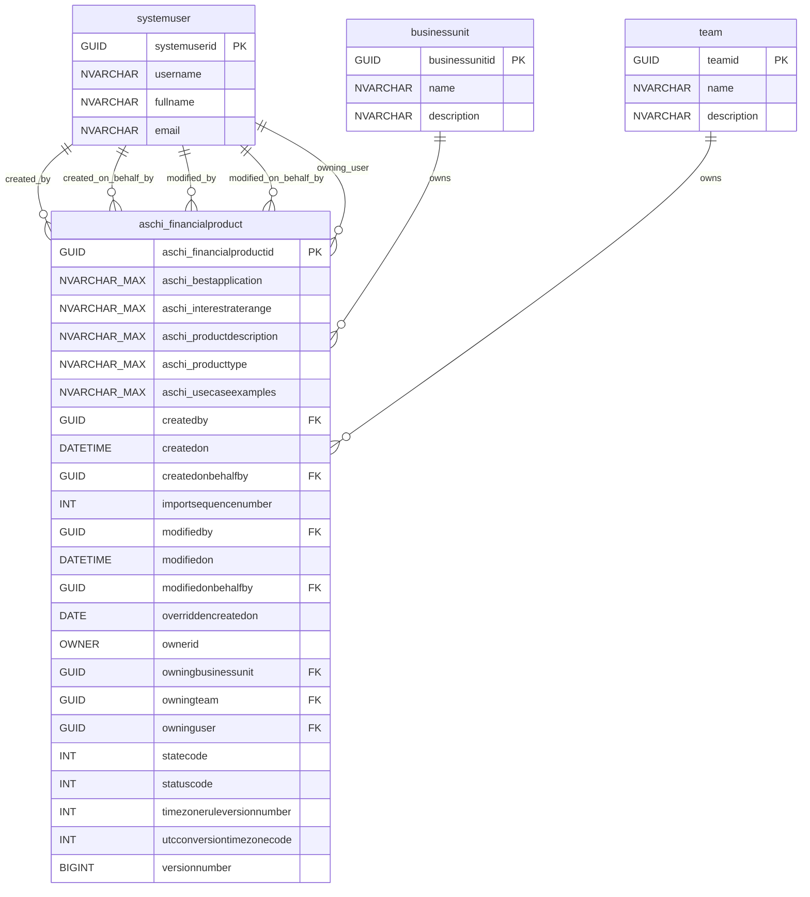

# Financial Products ER Diagram



## Table Descriptions

### aschi_financialproduct
Main entity representing financial products in the system.

**Key Fields:**
- `aschi_financialproductid`: Primary key (GUID)
- `aschi_producttype`: Type/category of the financial product
- `aschi_productdescription`: Detailed description of the product
- `aschi_interestraterange`: Interest rate information
- `aschi_bestapplication`: Best use cases for the product
- `aschi_usecaseexamples`: Specific examples of usage

**System Fields:**
- Audit fields (created/modified by, dates)
- Ownership fields (owner, business unit, team, user)
- State management (statecode, statuscode)
- Version control (versionnumber)

### Related Entities

#### systemuser
Represents users in the system who can create, modify, or own financial products.

#### businessunit
Organizational unit that can own financial products.

#### team
Team that can own financial products.

## Relationships

- **One-to-Many**: Each systemuser can create/modify multiple financial products
- **One-to-Many**: Each businessunit can own multiple financial products  
- **One-to-Many**: Each team can own multiple financial products

## Notes

- The table follows Microsoft Dynamics 365/Common Data Service naming conventions
- Multiple ownership patterns are supported (user, team, business unit)
- Full audit trail is maintained with created/modified tracking
- State management is implemented for lifecycle control

## Python Code to Convert Mermaid to PNG

```python
import os
import subprocess
import tempfile
from pathlib import Path

def mermaid_to_png(mermaid_content, output_path="financial_products_er_diagram.png"):
    """
    Convert Mermaid diagram content to PNG image.
    
    Prerequisites:
    - Install mermaid-cli: npm install -g @mermaid-js/mermaid-cli
    - Or use Docker: docker pull minlag/mermaid-cli
    
    Args:
        mermaid_content (str): The Mermaid diagram content
        output_path (str): Path for the output PNG file
    
    Returns:
        bool: True if conversion successful, False otherwise
    """
    
    # Mermaid diagram content
    mermaid_diagram = """
erDiagram
    aschi_financialproduct {
        GUID aschi_financialproductid PK
        NVARCHAR_MAX aschi_bestapplication
        NVARCHAR_MAX aschi_interestraterange
        NVARCHAR_MAX aschi_productdescription
        NVARCHAR_MAX aschi_producttype
        NVARCHAR_MAX aschi_usecaseexamples
        GUID createdby FK
        DATETIME createdon
        GUID createdonbehalfby FK
        INT importsequencenumber
        GUID modifiedby FK
        DATETIME modifiedon
        GUID modifiedonbehalfby FK
        DATE overriddencreatedon
        OWNER ownerid
        GUID owningbusinessunit FK
        GUID owningteam FK
        GUID owninguser FK
        INT statecode
        INT statuscode
        INT timezoneruleversionnumber
        INT utcconversiontimezonecode
        BIGINT versionnumber
    }

    systemuser {
        GUID systemuserid PK
        NVARCHAR username
        NVARCHAR fullname
        NVARCHAR email
    }

    businessunit {
        GUID businessunitid PK
        NVARCHAR name
        NVARCHAR description
    }

    team {
        GUID teamid PK
        NVARCHAR name
        NVARCHAR description
    }

    %% Relationships
    systemuser ||--o{ aschi_financialproduct : "created_by"
    systemuser ||--o{ aschi_financialproduct : "created_on_behalf_by"
    systemuser ||--o{ aschi_financialproduct : "modified_by"
    systemuser ||--o{ aschi_financialproduct : "modified_on_behalf_by"
    systemuser ||--o{ aschi_financialproduct : "owning_user"
    
    businessunit ||--o{ aschi_financialproduct : "owns"
    team ||--o{ aschi_financialproduct : "owns"
"""
    
    try:
        # Create temporary file for mermaid content
        with tempfile.NamedTemporaryFile(mode='w', suffix='.mmd', delete=False) as temp_file:
            temp_file.write(mermaid_diagram)
            temp_mmd_path = temp_file.name
        
        # Method 1: Using mermaid-cli (mmdc)
        try:
            # Check if mmdc is available
            subprocess.run(['mmdc', '--version'], check=True, capture_output=True)
            
            # Convert mermaid to PNG
            cmd = [
                'mmdc',
                '-i', temp_mmd_path,
                '-o', output_path,
                '-t', 'neutral',  # Theme
                '-b', 'white',    # Background color
                '--width', '1200',
                '--height', '800'
            ]
            
            result = subprocess.run(cmd, check=True, capture_output=True, text=True)
            print(f"✅ Successfully converted to {output_path}")
            return True
            
        except (subprocess.CalledProcessError, FileNotFoundError):
            print("❌ mermaid-cli (mmdc) not found. Trying Docker method...")
            
            # Method 2: Using Docker
            try:
                # Check if Docker is available
                subprocess.run(['docker', '--version'], check=True, capture_output=True)
                
                # Get absolute paths
                abs_temp_path = os.path.abspath(temp_mmd_path)
                abs_output_path = os.path.abspath(output_path)
                output_dir = os.path.dirname(abs_output_path)
                
                # Convert using Docker
                cmd = [
                    'docker', 'run', '--rm',
                    '-v', f'{output_dir}:/data',
                    '-v', f'{abs_temp_path}:/data/input.mmd',
                    'minlag/mermaid-cli',
                    '-i', '/data/input.mmd',
                    '-o', f'/data/{os.path.basename(output_path)}',
                    '-t', 'neutral',
                    '-b', 'white'
                ]
                
                result = subprocess.run(cmd, check=True, capture_output=True, text=True)
                print(f"✅ Successfully converted to {output_path} using Docker")
                return True
                
            except (subprocess.CalledProcessError, FileNotFoundError):
                print("❌ Docker not available either.")
                return False
                
    except Exception as e:
        print(f"❌ Error during conversion: {e}")
        return False
        
    finally:
        # Clean up temporary file
        if 'temp_mmd_path' in locals():
            try:
                os.unlink(temp_mmd_path)
            except:
                pass

def install_mermaid_cli():
    """
    Helper function to install mermaid-cli using npm
    """
    try:
        print("📦 Installing mermaid-cli...")
        subprocess.run(['npm', 'install', '-g', '@mermaid-js/mermaid-cli'], check=True)
        print("✅ mermaid-cli installed successfully!")
        return True
    except subprocess.CalledProcessError:
        print("❌ Failed to install mermaid-cli. Make sure Node.js and npm are installed.")
        return False
    except FileNotFoundError:
        print("❌ npm not found. Please install Node.js first.")
        return False

# Alternative method using Python libraries
def mermaid_to_png_python(output_path="financial_products_er_diagram.png"):
    """
    Alternative method using Python libraries (requires additional setup)
    
    Prerequisites:
    pip install playwright
    python -m playwright install chromium
    """
    try:
        from playwright.sync_api import sync_playwright
        
        mermaid_html = """
        <!DOCTYPE html>
        <html>
        <head>
            <script src="https://cdn.jsdelivr.net/npm/mermaid/dist/mermaid.min.js"></script>
        </head>
        <body>
            <div class="mermaid">
erDiagram
    aschi_financialproduct {
        GUID aschi_financialproductid PK
        NVARCHAR_MAX aschi_bestapplication
        NVARCHAR_MAX aschi_interestraterange
        NVARCHAR_MAX aschi_productdescription
        NVARCHAR_MAX aschi_producttype
        NVARCHAR_MAX aschi_usecaseexamples
        GUID createdby FK
        DATETIME createdon
        GUID createdonbehalfby FK
        INT importsequencenumber
        GUID modifiedby FK
        DATETIME modifiedon
        GUID modifiedonbehalfby FK
        DATE overriddencreatedon
        OWNER ownerid
        GUID owningbusinessunit FK
        GUID owningteam FK
        GUID owninguser FK
        INT statecode
        INT statuscode
        INT timezoneruleversionnumber
        INT utcconversiontimezonecode
        BIGINT versionnumber
    }

    systemuser {
        GUID systemuserid PK
        NVARCHAR username
        NVARCHAR fullname
        NVARCHAR email
    }

    businessunit {
        GUID businessunitid PK
        NVARCHAR name
        NVARCHAR description
    }

    team {
        GUID teamid PK
        NVARCHAR name
        NVARCHAR description
    }

    %% Relationships
    systemuser ||--o{ aschi_financialproduct : "created_by"
    systemuser ||--o{ aschi_financialproduct : "created_on_behalf_by"
    systemuser ||--o{ aschi_financialproduct : "modified_by"
    systemuser ||--o{ aschi_financialproduct : "modified_on_behalf_by"
    systemuser ||--o{ aschi_financialproduct : "owning_user"
    
    businessunit ||--o{ aschi_financialproduct : "owns"
    team ||--o{ aschi_financialproduct : "owns"
            </div>
            <script>
                mermaid.initialize({startOnLoad:true});
            </script>
        </body>
        </html>
        """
        
        with sync_playwright() as p:
            browser = p.chromium.launch()
            page = browser.new_page()
            page.set_content(mermaid_html)
            page.wait_for_selector('.mermaid svg')
            page.screenshot(path=output_path, full_page=True)
            browser.close()
            
        print(f"✅ Successfully converted to {output_path} using Playwright")
        return True
        
    except ImportError:
        print("❌ Playwright not installed. Run: pip install playwright && python -m playwright install chromium")
        return False
    except Exception as e:
        print(f"❌ Error with Playwright method: {e}")
        return False

if __name__ == "__main__":
    print("🔄 Converting Mermaid ER diagram to PNG...")
    
    # Try the main method first
    success = mermaid_to_png()
    
    # If that fails, try the Python/Playwright method
    if not success:
        print("🔄 Trying alternative Python method...")
        success = mermaid_to_png_python()
    
    if not success:
        print("\n📋 Installation Options:")
        print("1. Install mermaid-cli: npm install -g @mermaid-js/mermaid-cli")
        print("2. Use Docker: docker pull minlag/mermaid-cli")
        print("3. Install Playwright: pip install playwright && python -m playwright install chromium")
```

### Usage Instructions

1. **Save the code** above as `convert_mermaid.py`

2. **Choose your preferred method:**

   **Method 1 - mermaid-cli (Recommended):**
   ```bash
   npm install -g @mermaid-js/mermaid-cli
   python convert_mermaid.py
   ```

   **Method 2 - Docker:**
   ```bash
   docker pull minlag/mermaid-cli
   python convert_mermaid.py
   ```

   **Method 3 - Python/Playwright:**
   ```bash
   pip install playwright
   python -m playwright install chromium
   python convert_mermaid.py
   ```

3. **Run the script** and it will generate `financial_products_er_diagram.png`